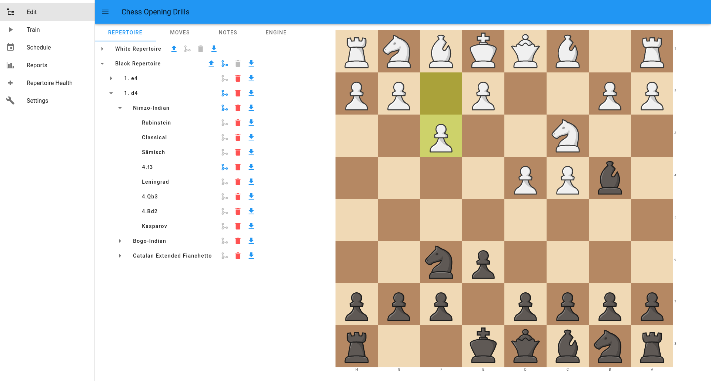
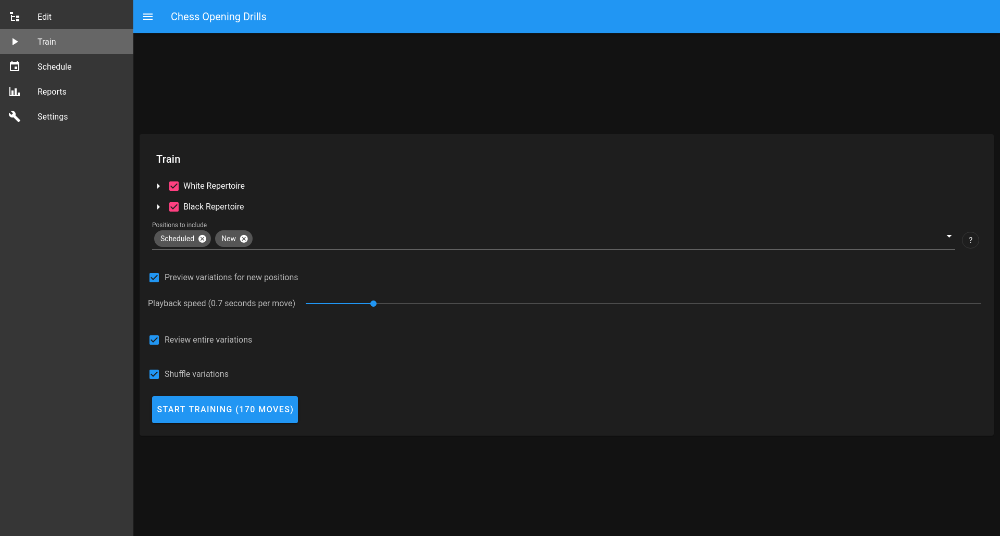

# Chess Opening Drills

A cross platform chess opening preparation tool. Chess Opening Drills provides a modern experience for _practicing_ an opening repertoire. Chess Opening Drills is not a database tool to develop a repertoire, there are already many tools available for that.

**This is an unfinished tool under active development and should be considered unstable. Keep PGN backups of your repertoire.**

## Features

- Train moves using a modified [SM-2](https://www.supermemo.com/en/archives1990-2015/english/ol/sm2) spaced repetition algorithm.
- Generate reports on your repertoire and training history.
- Transpositions between variations are detected automatically.
- Import and export your repertoire as PGN.

## Screenshots

## Roadmap

See [Roadmap](Roadmap.md).

## Contributing

See [Contributing](CONTRIBUTING.md)
